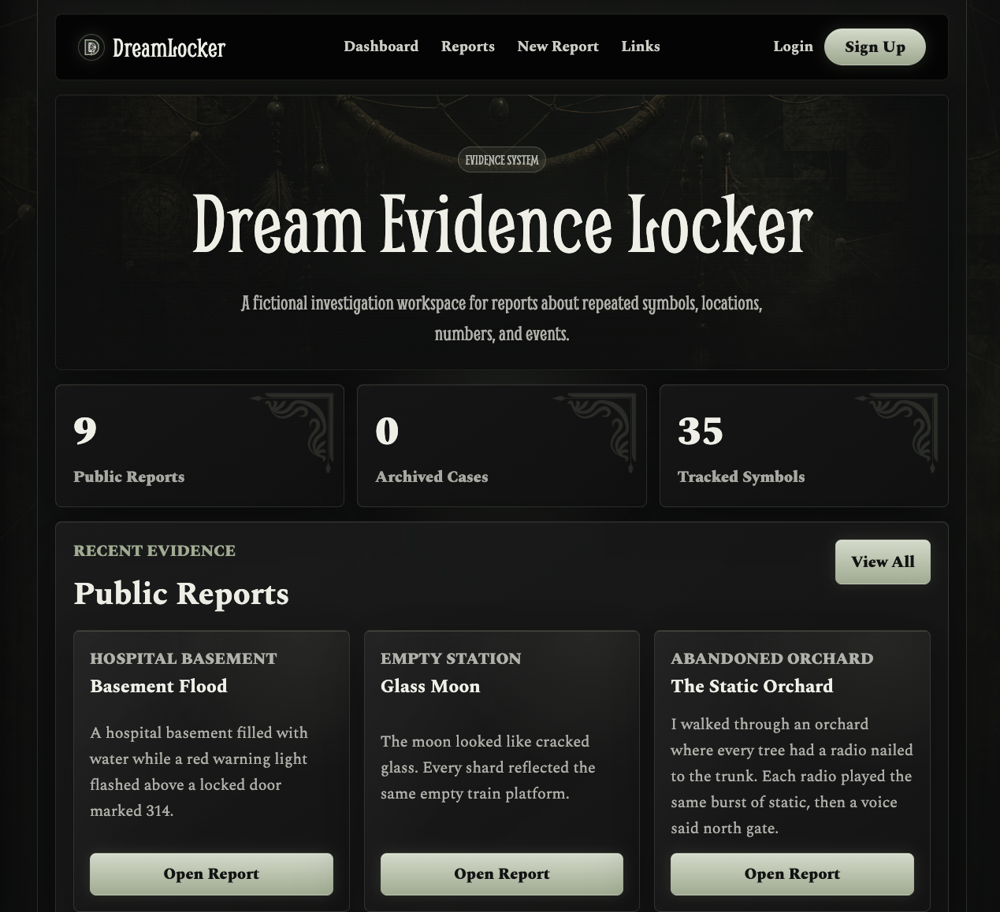
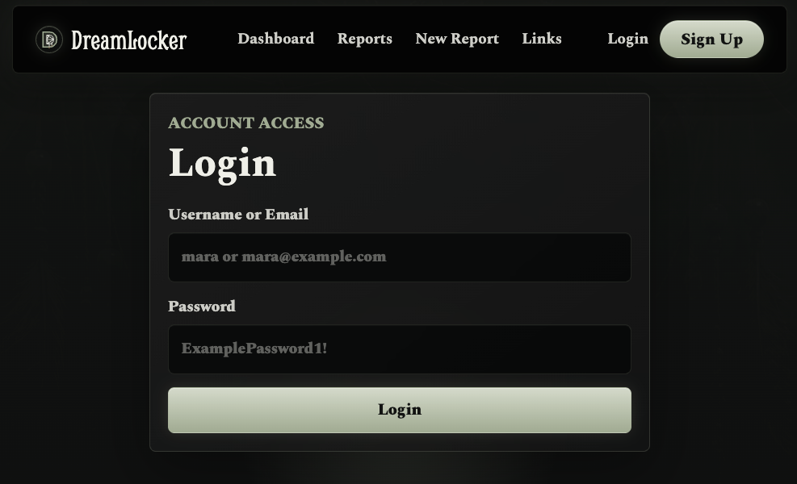
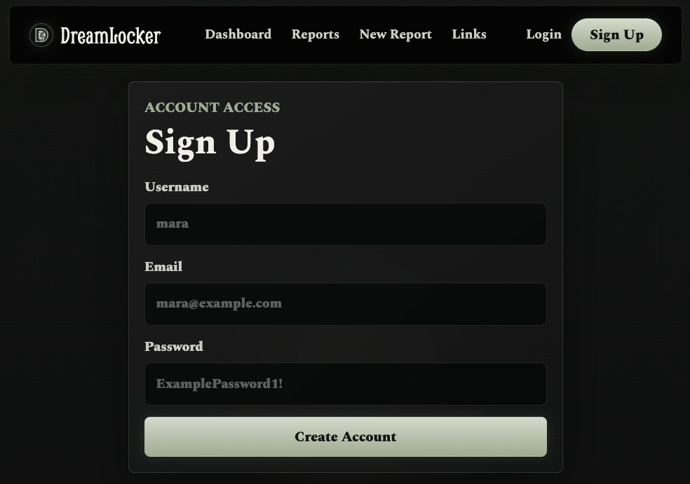
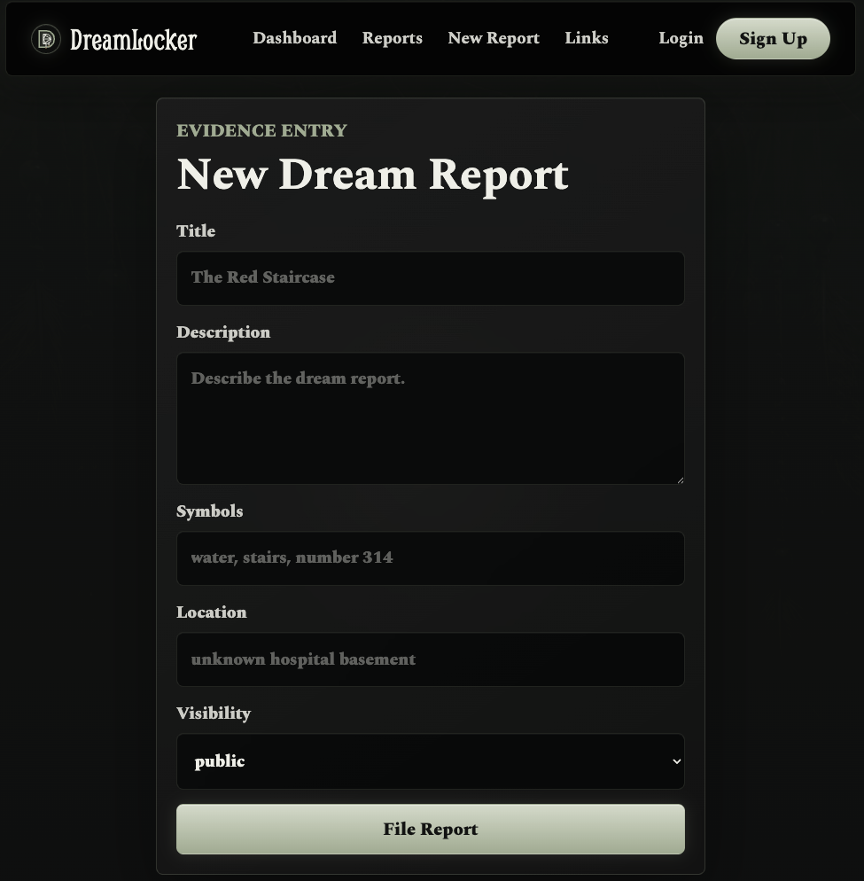

# Dream Evidence Locker

Dream Evidence Locker is a minimal PERN hackathon project.

The app is a fictional investigation system where users submit strange dreams as evidence. Dreamers file reports. Investigators review patterns and report links. Admins can access restricted evidence areas.

## Current Project Status

This project currently has:

- React client built with Vite
- Express server using ES modules
- PostgreSQL database schema
- Seed data for users, reports, archived reports, and report links
- Authentication routes for signup and signin
- Password hashing with bcrypt
- JSON Web Token login response
- Protected server routes for report creation, report editing, archive data, and report links
- Dark dream investigation CSS theme
- Dashboard page
- Public reports page
- Single report detail page
- New report form
- Edit report form
- Report links page
- Archive page
- Login page
- Sign up page

## Screenshots

### Dashboard



### Login



### Sign Up



### New Report



## Tech Stack

- PostgreSQL
- Express
- React
- Node.js
- Vite
- bcrypt
- JSON Web Tokens

## Project Structure

```text
dream-locker/
  client/
    api/
      authenticatedFetch.js
    public/
      assets/
      images/
    src/
      components/
        ArchivePage.jsx
        Dashboard.jsx
        Header.jsx
        LinksPage.jsx
        LoginPage.jsx
        ReportDetail.jsx
        ReportForm.jsx
        ReportsPage.jsx
        SignupPage.jsx
      App.jsx
      index.css
      main.jsx
    package.json
    vite.config.js
  server/
    db/
      pool.js
      schema.sql
      seed.sql
    middleware/
      authMiddleware.js
      validateAuth.js
    routes/
      auth.js
    utils/
      password.js
    index.js
    package.json
```

## Setup Instructions

These steps are for setting up the project on another computer.

### 1. Clone the repository

```bash
git clone https://github.com/itspaigenli/dream-locker.git
cd dream-locker
```

### 2. Install PostgreSQL

PostgreSQL must be installed and running before the server can connect to the database.

Check if `psql` exists:

```bash
psql --version
```

If that command does not work, install PostgreSQL before continuing.

### 3. Create the database

The project expects a local database named `locker_db`.

```bash
createdb locker_db
```

### 4. Install server dependencies

```bash
cd server
npm install
```

### 5. Create the server environment file

Inside the `server/` folder, create a file named `.env`.

Use `server/.env-sample` as the pattern:

```env
DATABASE_URL=postgresql://YOUR_POSTGRES_USERNAME@localhost:5432/locker_db
PORT=3000
CLIENT_ORIGIN=http://localhost:5173
JWT_SECRET=your_jwt_secret_here
```

Replace `YOUR_POSTGRES_USERNAME` with the local PostgreSQL username.

On a Mac, this is often the same as the computer username. To check it:

```bash
whoami
```

Example:

```env
DATABASE_URL=postgresql://nessali@localhost:5432/locker_db
PORT=3000
CLIENT_ORIGIN=http://localhost:5173
JWT_SECRET=replace_this_with_a_long_secret_value
```

### 6. Build the database tables

Run this from the `server/` folder:

```bash
npm run db:schema
```

What this does:

- Drops the current project tables if they exist
- Creates the `users` table
- Creates the `dream_reports` table
- Creates the `report_links` table

### 7. Add seed data

Run this from the `server/` folder:

```bash
npm run db:seed
```

What this adds:

- Example users
- Active public reports
- Active private reports
- Archived resolved reports
- Example report links

The user records use bcrypt password hashes.

### 8. Start the server

Run this from the `server/` folder:

```bash
npm run dev
```

The server should run at:

```text
http://localhost:3000
```

Health check route:

```text
http://localhost:3000/api/health
```

Expected response:

```json
{
  "message": "Dream Evidence Locker API is running"
}
```

### 9. Install client dependencies

Open a second terminal.

From the project root:

```bash
cd client
npm install
```

### 10. Create the client environment file

Inside the `client/` folder, create a file named `.env`.

Use `client/.env-sample` as the pattern:

```env
VITE_API_URL=http://localhost:3000/api
```

### 11. Start the client

Run this from the `client/` folder:

```bash
npm run dev
```

The client should run at:

```text
http://localhost:5173
```

## Server Scripts

Run these commands from the `server/` folder.

```bash
npm run dev
```

Starts the Express server with `nodemon`.

```bash
npm start
```

Starts the Express server with Node.

```bash
npm run db:check
```

Checks that PostgreSQL responds.

```bash
npm run db:connect
```

Connects to the `locker_db` database with `psql`.

```bash
npm run db:schema
```

Rebuilds the database tables.

```bash
npm run db:seed
```

Adds the project seed data.

```bash
npm test
```

Runs server tests with Vitest.

Current note: server test files still need to be added.

## Client Scripts

Run these commands from the `client/` folder.

```bash
npm run dev
```

Starts the Vite development server.

```bash
npm run build
```

Creates a production build in `client/dist`.

`client/dist` is generated output. It is not source code.

```bash
npm run lint
```

Runs ESLint.

```bash
npm test
```

Runs client tests with Vitest.

Current note: client test files still need to be added.

## Current API Routes

Base API URL:

```text
http://localhost:3000/api
```

### Health

```text
GET /api/health
```

Checks that the server is running.

### Auth

```text
POST /api/auth/signup
```

Creates a new dreamer account.

Current request body pattern:

```json
{
  "username": "mara",
  "email": "mara@example.com",
  "password": "ExamplePassword1!"
}
```

```text
POST /api/auth/signin
```

Signs in with a username or email and password.

Current request body pattern:

```json
{
  "identifier": "mara",
  "password": "ExamplePassword1!"
}
```

The signin response includes a token and user object.

### Reports

```text
GET /api/reports
```

Returns active public reports.

```text
GET /api/reports/:id
```

Returns one active public report by id.

```text
POST /api/reports
```

Creates a report.

Current protection:

- Requires a valid login token
- Uses the logged-in user's id as the report owner

Current request body pattern:

```json
{
  "title": "The Red Staircase",
  "description": "Dream description text",
  "symbols": "red staircase, hospital, water, 314",
  "location": "unknown hospital basement",
  "visibility": "public"
}
```

```text
PUT /api/reports/:id
```

Updates a report.

Current protection:

- Requires a valid login token
- Allows admins to edit
- Allows the report owner to edit if the report is not archived

### Archive

```text
GET /api/archive
```

Returns archived reports.

Current protection:

- Requires a valid login token
- Requires the `investigator` or `admin` role

Archived reports represent resolved or closed evidence files.

### Report Links

```text
GET /api/report-links
```

Returns existing links between reports.

Current protection:

- Requires a valid login token
- Requires the `investigator` or `admin` role

## Database Tables

### users

Stores user records.

Columns:

- `id`
- `username`
- `email`
- `password_hash`
- `role`
- `created_at`

Current roles:

- `dreamer`
- `investigator`
- `admin`

### dream_reports

Stores dream report records.

Columns:

- `id`
- `user_id`
- `title`
- `description`
- `symbols`
- `location`
- `visibility`
- `archived`
- `created_at`
- `updated_at`

Current visibility values:

- `public`
- `private`

### report_links

Stores official links between related reports.

Columns:

- `id`
- `source_report_id`
- `target_report_id`
- `investigator_id`
- `reason`
- `created_at`

## Current App Pages

### Dashboard

Shows summary counts and recent public reports.

### All Reports

Shows active public reports.

Private reports are seeded in the database, but the current public route does not show them.

### Report Detail

Shows one active public report.

### New Report

Shows a form for creating a report.

Current note: report creation requires login because the backend uses the logged-in user's id.

### Edit Report

Shows a form for updating a report.

Current note: edit requests require login. The backend currently checks owner/admin rules during update.

### Linked Reports

Shows existing report links from the seed data.

Current note: this page loads protected data. The backend requires an investigator or admin token.

### Archive

Shows archived resolved reports.

Current note: this page loads protected data. The backend requires an investigator or admin token.

### Login

Lets a user sign in with username or email and password.

### Sign Up

Lets a user create a dreamer account.

## Files That Should Not Be Committed

Do not commit:

- `node_modules`
- `.env`
- `client/dist`
- `.DS_Store`
